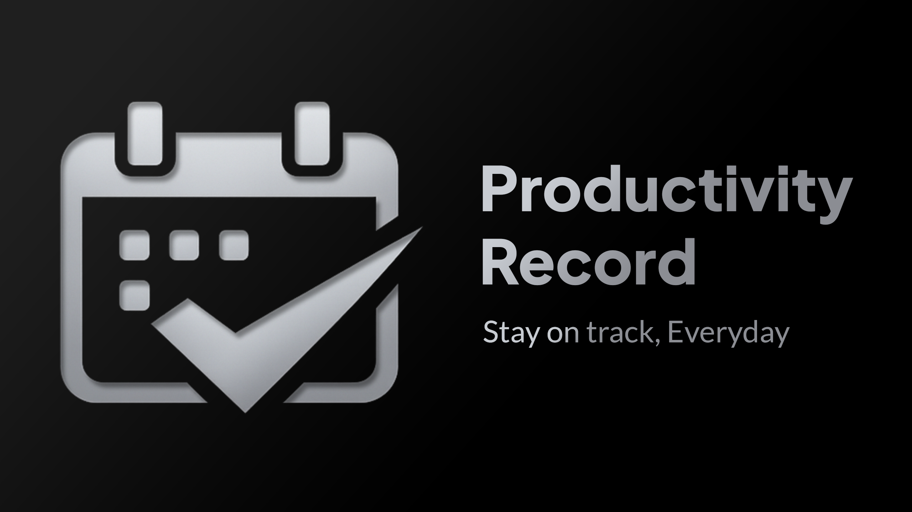

<p align="center">
  
</p>

<h1 align="center">ProductivityRecord</h1>

<p align="center">
  <em>Track everything. Miss nothing.</em>
</p>

<p align="center">
  Platform produktivitas personal — murni frontend, tanpa login, tanpa server — untuk mencatat dan merekap keuangan, to-do list, habit, journal, dan workout langsung dari browser.
</p>

<p align="center">
  
  
  
</p>

---

## 📖 Tentang ProductivityRecord

**ProductivityRecord** adalah aplikasi web personal untuk menyatukan pencatatan produktivitas sehari-hari dalam satu tempat — tanpa perlu login, tanpa server, tanpa setup rumit. Semua data tersimpan langsung di browser (`localStorage`), sehingga aplikasi bisa dipakai kapan saja hanya dengan membuka halamannya.

Latar belakang & tujuan proyek lebih lengkap ada di [`docs/CONTEXT.md`](docs/CONTEXT.md).

## ✨ Fitur

Dibangun secara bertahap per modul:

| Modul | Deskripsi |
|---|---|
| 💰 **Finance** | Catat pemasukan/pengeluaran harian, rekap per hari/minggu/bulan |
| ✅ **To-Do List** | CRUD task, prioritas, kategori/tag, sub-task, recurring task, reminder, tampilan kalender |
| 🔥 **Habit Tracker** | Catat kebiasaan harian, check-in harian, perhitungan streak |
| 📓 **Journal** | Catatan harian dengan timestamp & mood tag |
| 🏋️ **Gym & Workout** | Log latihan (set, rep, berat), riwayat progress |
| 📊 **Dashboard** | Ringkasan statistik gabungan dari seluruh modul |

Detail requirement tiap modul ada di [`docs/PRD.md`](docs/PRD.md).

## 🛠️ Tech Stack

| Layer | Teknologi |
|---|---|
| Frontend | HTML, CSS, Vanilla JavaScript |
| Penyimpanan Data | `localStorage` (browser) |
| Hosting | [GitHub Pages](https://pages.github.com) |
| Icon | [Lucide](https://lucide.dev) |
| Animasi | [AOS](https://michalsnik.github.io/aos/) (Animate On Scroll) |

Tanpa backend, tanpa database eksternal, tanpa autentikasi. Arsitektur lengkap ada di [`docs/ARCHITECTURE.md`](docs/ARCHITECTURE.md).

## 🎨 Desain

Tema **dark mode** dengan aksen **silver/metallic**, font **Montserrat**, dan komponen card/list yang disesuaikan per modul. Design system lengkap ada di [`docs/DESIGN.md`](docs/DESIGN.md).

<p align="center">
  
</p>

## 📂 Struktur Proyek

```
ProductivityRecord/
├── assets/
│   ├── favicon/
│   └── image/
│       ├── banner/
│       └── logo/
├── css/
│   ├── base.css
│   ├── component.css
│   ├── layout.css
│   ├── reset.css
│   ├── responsive.css
│   └── variable.css
├── js/
│   ├── main.js
│   ├── storage.js
│   └── modules/
├── docs/
│   ├── AGENT.md
│   ├── ARCHITECTURE.md
│   ├── CONTEXT.md
│   ├── DESIGN.md
│   ├── PRD.md
│   ├── SPEC.md
│   └── TODO.md
├── index.html
└── README.md
```

## 🚀 Getting Started

Karena murni frontend, tidak ada instalasi dependency atau environment variable yang dibutuhkan.

### Menjalankan Secara Lokal

```bash
git clone https://github.com/alfzilham/ProductivityRecord.git
cd ProductivityRecord
```

Buka `index.html` langsung di browser, atau jalankan lewat local server sederhana (opsional, untuk menghindari isu path relatif):

```bash
npx serve .
```

### Deploy

Proyek ini di-deploy lewat **GitHub Pages**. Aktifkan lewat repo Settings → Pages → pilih branch `main` (folder root), lalu situs otomatis tersedia di `https://alfzilham.github.io/ProductivityRecord/`.

## ⚠️ Catatan Penting Soal Data

- Semua data tersimpan di `localStorage` **browser tempat kamu membuka aplikasi** — tidak sync ke device/browser lain.
- Menghapus cache/data browser akan **menghapus seluruh data** yang tercatat.
- Belum ada fitur backup/export di versi awal (lihat [`docs/TODO.md`](docs/TODO.md) untuk rencana ke depan).

## 🗺️ Roadmap

- [ ] **Fase 1** — Finance
- [ ] **Fase 2** — To-Do List
- [ ] **Fase 3** — Habit Tracker
- [ ] **Fase 4** — Journal
- [ ] **Fase 5** — Gym & Workout
- [ ] **Fase 6** — Dashboard

Progress detail ada di [`docs/TODO.md`](docs/TODO.md).

## 📚 Dokumentasi

| Dokumen | Isi |
|---|---|
| [`docs/AGENT.md`](docs/AGENT.md) | Panduan untuk AI coding agent yang bekerja di repo ini |
| [`docs/ARCHITECTURE.md`](docs/ARCHITECTURE.md) | Arsitektur sistem & tech stack |
| [`docs/CONTEXT.md`](docs/CONTEXT.md) | Latar belakang & tujuan proyek |
| [`docs/DESIGN.md`](docs/DESIGN.md) | Design system UI/UX |
| [`docs/PRD.md`](docs/PRD.md) | Product requirements per modul |
| [`docs/SPEC.md`](docs/SPEC.md) | Spesifikasi teknis (struktur `localStorage`) |
| [`docs/TODO.md`](docs/TODO.md) | Checklist task & known issues |

## 📄 Lisensi

Proyek ini menggunakan lisensi [MIT](LICENSE).

---

<p align="center">
  Dibuat oleh <a href="https://github.com/alfzilham">alfzilham</a>
</p>
